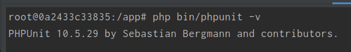
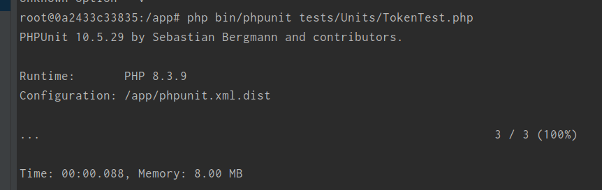

# Тестовое задание

Недавно проходил лайв кодинг. Задача была озвучена устно и примерно звучаала так:

Нужно генерировать какой то индивидуальный код длинною 50 символов, у которого срок жизни 2 часа.

Их не интересовала архитектура, инфраструктура и т.д. Им было интересно что я сделаю, и как реализую.

Так как собедователи много раз упоминали что у них DDD, я решил, что скорей всего они говорят про Value Objects.

## Реализация

Не претендую на идеальность или правильность данного решения, но я ее видел на данный момент именно так. Генерацию токена можно реализовать по разному, тут всего лишь один из примеров.

В папке tests приложен юнит тест.

Для тестирования я использовал phpunit версии 10.5.29

Тест проверет три состояние объекта:
1) Создание объекта
2) Создание объекта, и получение токена 50 в символов
3) Вывод исключения, если срок действия токена истек

PS: Возможно что то упустил